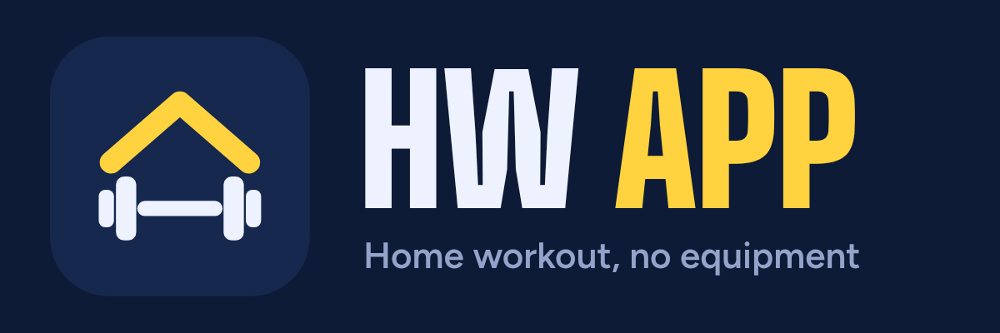
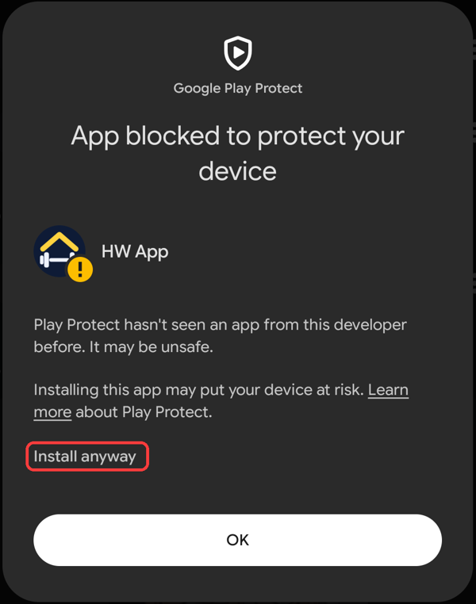

# HW App 💪

**HW App** (home workout app) is a free app for training at home with no equipment. It's an Android app; the website version works in any browser too.

## Install it on your phone (Android)
Needs Android 8.0 or newer.

1. On your phone, open the newest release: https://github.com/mikydon/hw-app/releases/latest
2. Download **HW-App-x.y.z.apk** (only this file) and open it.
3. If Android asks, allow installing apps from your browser.
4. Google Play Protect may say *App blocked to protect your device*, because the app isn't from the Play Store. Tap **Install anyway** (on some phones it's under *More details*):

   

5. Updates: small ones arrive inside the app by themselves; for a big one the app shows a card with the new APK. Install it over the old one, your data stays.

**Coming from the website?** In the browser: Settings → *Save backup*. In the app: Settings → *Restore from backup*.

## Website (any phone, also iPhone)
Open https://mikydon.github.io/hw-app/ and add it to your home screen (Android Chrome: menu ⋮ → *Install app*; iPhone Safari: Share → *Add to Home Screen*). It works offline too. Data in the website and in the Android app are separate.

## What it does
- 3 workout days (A, B, C), trained every other day: push, pull, legs and core in a circuit of 2 or 3 rounds
- the rep counter starts at 0 and shows last time's result with a +1 goal, so you keep beating yourself
- one menu (☰, top right) for everything; during a workout you can open other screens and the workout keeps running in a small floating window
- calorie calculator (Mifflin-St Jeor, like calculator.net) with lose / maintain / gain targets, workouts from the app added automatically, and a daily food log
- birthday surprises (greeting, confetti, a free streak freeze) when you enter your birth date
- warm-up, timers, sounds and rest breaks between exercises, with tips during the rest; optional stretching at the end (hip flexor, cobra, child's pose)
- a drawing (yellow line = belly side), instructions and a video link for every exercise
- 27 exercises, each marked easier, medium or harder; when one gets easy, its tip points to the harder version and lets you swap to it
- swap an exercise when one doesn't work for you, or turn off exercises you can't do in Settings → Exercises (the app replaces them with another of the same type)
- XP, levels, a 🔥 streak with freezes, ranks per exercise (Wood to Diamond), weekly challenges and badges with levels (Wood to Diamond)
- history with a calendar and a progress chart; edit or delete past workouts, or add one you did without the app
- a new motivational line every day (a rest-day one after a workout), and cards you can close
- backup and restore of all your data as a file, and a "start over from zero" reset that keeps your profile
- 14 languages: English, Slovenčina, Čeština, Polski, Magyar, Українська, Deutsch, Español, Français, Italiano, Português, 中文（简体）, 日本語, 한국어. The app picks your phone's language automatically (English if yours isn't there yet); you can change it in Settings. Found a mistake or missing your language? See [TRANSLATING.md](TRANSLATING.md).

What changed in each version: [CHANGELOG.md](CHANGELOG.md).

## Privacy
All your data (workouts, calories, name, photo, birth date) is stored only on your device: in the app, or in the browser on the website. Nothing you enter is sent anywhere. If you connect Health Connect, the app reads only your daily step count, and it stays on your phone. If you clear the browser's data, the website's history is deleted too, so save a backup in Settings first. Full policy: [privacy.html](https://mikydon.github.io/hw-app/privacy.html).

## For developers
- Source: `src/App.jsx` (React), entry `src/main.jsx`
- Texts: `src/i18n/<lang>.js`. English (`en.js`) is the base; every other language falls back to it key by key.
  - To add a language: copy `en.js`, translate it, add it to `LANGS` and `SOURCES` in `src/i18n/index.js`, then run `node src/i18n/check.mjs <code>` (it checks keys, placeholders and plural forms).
- Build: `npm install`, then `npm run build`. This creates `index.html` with everything in one file.
- The site runs on GitHub Pages from the `main` branch, folder `/` (root).
- Logo and icons: `assets/mark.svg` (logo), `assets/icon-maskable.svg` (Android icon), `assets/logo-wordmark.svg`.
